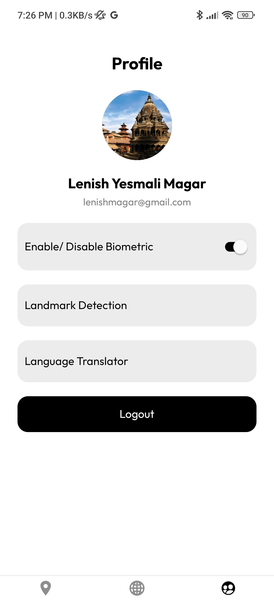
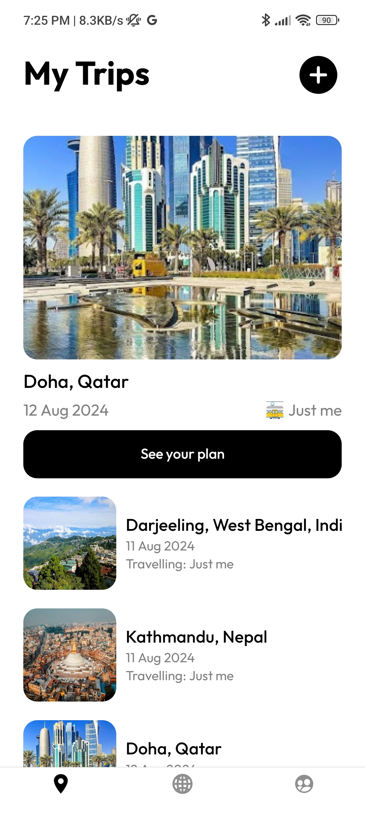
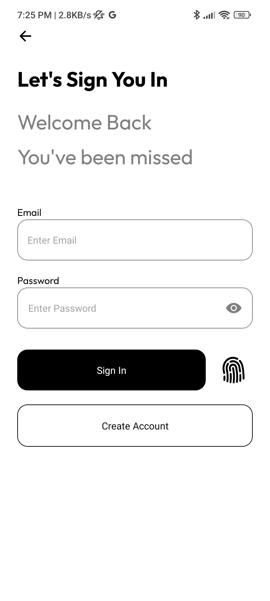

# Welcome to your Expo app 👋

This is an [Expo](https://expo.dev) project created with [`create-expo-app`](https://www.npmjs.com/package/create-expo-app).

## Get started

1. Install dependencies

   ```bash
   npm install
   ```
2. Rename Temp_env.js to env.js


# 🌟 Additional Setup
To fully leverage the features of this app, you need to enable the following Google APIs:

- Google Places API: Required for location-based services.
- Geocoding API: Needed for converting addresses into geographic coordinates.
- Google Vision API: Used for image analysis and recognition.
- Google Cloud Translator API: Enables translation of text into multiple languages.
Follow the setup guides linked above to enable these APIs and configure your project accordingly.

3. Start the app

   ```bash
    npm run start
   ```

## 📸 Screenshots

Here are some screenshots of the app in action:

### Profile Screen


### Home Screen


### Starting Screen


### Login Screen
